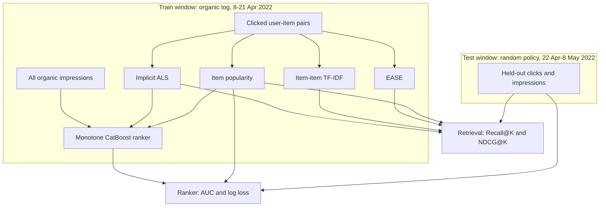

# KuaiRand two-stage recommender

Short-video recommender for the public [KuaiRand-Pure](https://zenodo.org/records/10439422) logs. Candidate generation (implicit ALS, item-item TF-IDF, and EASE) and a pointwise CatBoost ranker are trained on the organic traffic from 8–21 April 2022 and scored on the later random-policy window, beside a popularity baseline fit on the same train rows.

Random exposure is the unbiased slice in KuaiRand: every impression in that window was shown under a random policy, so offline click metrics are not just a replay of the production ranker.

## Architecture



Serving still follows the same split: retrieve a candidate pool, then score it with the ranker. The offline numbers below are the catalog-level retrieval eval and the impression-level ranker eval, not a replay of the FastAPI path.

## Data and features

| Split | File | Rows | Role |
| --- | --- | --- | --- |
| Train | `log_standard_4_08_to_4_21_pure.csv` | 1,141,112 | Organic impressions, click rate 0.463447 |
| Test | `log_random_4_22_to_5_08_pure.csv` | 1,186,059 | Random-policy impressions, click rate 0.176158 |

The retrieval catalog has 7,583 videos. Retrieval metrics use the 21,381 warm users who clicked in train and still have a test click on a video they had not clicked before.

Label for both stages is `is_click`.

**Retrieval**

Hyperparameters for the new retrievers were chosen on an organic validation slice only: fit on dates before 20220418 (1,055,237 rows) and score dates 20220418–20220421 (85,875 rows, 14,072 users, 7,538 videos). The random-policy log was not read until that choice was fixed. The selection score is the mean of Recall@10, Recall@20, Recall@50, and NDCG@50, with Recall@10 as the tie-break. Winners are refit on the full organic log before the test pass.

- Popularity: distinct train users who clicked the video.
- ALS (published baseline): 64 factors, 15 iterations, L2 0.05, confidence alpha 40, binary clicks, seed 42.
- ALS tuned: 64 factors, 15 iterations, L2 0.5, confidence alpha 1, TF-IDF weighting. Validation score 0.142924 (Recall@10 0.080551). Grid: factors {32, 64, 128}, L2 {0.01, 0.05, 0.5}, iterations {15, 30}, alpha {1, 40}, weighting {binary, BM25, TF-IDF, log play time}, 144 trials.
- ItemKNN: implicit TF-IDF nearest neighbours, 200 neighbours. Validation score 0.123118. Grid: cosine / BM25 / TF-IDF × K {20, 50, 100, 200}.
- EASE: binary clicks, L2 λ 200. Validation score 0.142034. Grid: weighting {binary, BM25} × λ {1, 10, 50, 200, 1000, 5000}.
- Hybrid: per-user z-score of tuned ALS plus a global z-score of popularity, CF weight 0.9. Validation score 0.143557, the best score on the organic slice. Weights 0.0–1.0 in steps of 0.1 were compared for z-score and reciprocal rank fusion on each pure retriever. Weight 0 is popularity.

**Ranker** (CatBoost log loss, depth 4, 150 iterations, learning rate 0.08, `l2_leaf_reg` 5, seed 42)

- `als_score`: dot product of the train-only user and item factors. Missing factors score 0.
- `pop_score`: `log1p` of the popularity count.
- `user_ctr`: Laplace-smoothed train click rate `(clicks + 1) / (impressions + 2)`. Users absent from train get the global train click rate.
- Each feature is monotone non-decreasing in predicted click probability.
- The popularity baseline is the same CatBoost setup fit on `pop_score` only.

Platform-wide video statistic files from the release are not used. They pool behavior across the whole collection window, including the test dates.

## Results

Numbers are copied from [`results/kuairand_pure_metrics.json`](results/kuairand_pure_metrics.json), produced by `make eval` on KuaiRand-Pure.

### Retrieval

Full catalog, macro-average over 21,381 users. Already-clicked train videos are removed from the list. With 7,583 videos, most future clicks sit outside the top 10, so absolute Recall@K stays small and the baseline comparison is the result that matters.

| Model | Recall@10 | NDCG@10 | Recall@20 | NDCG@20 | Recall@50 | NDCG@50 |
| --- | ---: | ---: | ---: | ---: | ---: | ---: |
| Popularity | 0.003293 | 0.003351 | 0.006236 | 0.00432 | 0.012593 | 0.006181 |
| ALS (published) | 0.002819 | 0.002776 | 0.005357 | 0.003639 | 0.014008 | 0.006347 |
| ALS tuned | 0.002673 | 0.002708 | 0.005402 | 0.003633 | 0.013603 | 0.006267 |
| ItemKNN | 0.003077 | 0.003085 | 0.005626 | 0.003987 | 0.013701 | 0.006494 |
| EASE | 0.00304 | 0.002987 | 0.005729 | 0.003901 | 0.013956 | 0.006495 |
| Hybrid (tuned ALS, z-score, weight 0.9) | 0.002636 | 0.00275 | 0.005383 | 0.003636 | 0.013772 | 0.006291 |

Popularity has the highest Recall@10, NDCG@10, Recall@20, and NDCG@20. The published ALS has the highest Recall@50. EASE has the highest NDCG@50 (0.006495 versus popularity 0.006181). ItemKNN is next on NDCG@50 (0.006494) and is the closest retriever to popularity at 10 and 20, still short of it. Tuned ALS and the validation-chosen hybrid are below popularity at every cutoff except Recall@50 and NDCG@50, and both are below the published ALS on Recall@50 and NDCG@50. Organic validation rewarded TF-IDF ALS and a 0.9 collaborative weight; that choice does not transfer to the random-policy slice, where item popularity remains the stronger short-list signal.

### Ranker

Scored on all 1,186,059 random-policy impressions.

| Model | AUC | Log loss |
| --- | ---: | ---: |
| Popularity | 0.573373 | 0.522033 |
| CatBoost ranker | 0.65684 | 0.664248 |

The full-organic ranker with the published ALS feature ranks clicks better (AUC 0.65684 versus 0.573373). Popularity has the lower log loss (0.522033 versus 0.664248). Historical user CTR still orders who is more likely to click under a random policy, while the probability level was learned on organic traffic whose click rate is 0.463447. Random-policy impressions land on the long tail, where a popularity model emits lower probabilities and lands closer to the 0.176158 test rate.

Replacing the retrieval feature with tuned ALS (the pure retriever with the best organic validation score) lowers AUC to 0.629444 and log loss to 0.567346. AUC is still above popularity. Log loss is still above popularity's 0.522033.

Calibration uses a separate fit. The ranker is trained only on organic dates before 20220418. Isotonic regression and Platt scaling are fit on organic dates from 20220418 onward, and the method with the lower validation log loss is applied to the random-policy test. Isotonic won for every model. These rows are not the full-organic model above.

| Model | Calibrator | AUC before | Log loss before | AUC after | Log loss after |
| --- | --- | ---: | ---: | ---: | ---: |
| CatBoost, published ALS feature | isotonic | 0.648072 | 0.689786 | 0.644494 | 0.497315 |
| CatBoost, tuned ALS feature | isotonic | 0.623909 | 0.577651 | 0.610844 | 0.499324 |
| Popularity | isotonic | 0.572359 | 0.525998 | 0.572075 | 0.512322 |

Isotonic lowers test log loss for all three. The published-ALS ranker after isotonic (0.497315) is below the calibrated popularity log loss (0.512322). AUC drops slightly for each model. Organic validation click rates are still far above the 0.176158 random-policy rate, so this is a probability remap chosen without test labels, not a fix for the policy shift itself.

## Reproduce

```bash
bash scripts/download_kuairand_pure.sh
make eval
```

`make eval` writes `results/kuairand_pure_metrics.json`. A laptop-scale check that does not download KuaiRand:

```bash
make smoke
```

Other local targets: `make lint`, `make type`, `make test`.

## Design decisions

- **KuaiRand-Pure** is the smallest public variant (about 46MB compressed). KuaiRand-1K and KuaiRand-27K are the scale-up, not the run behind the table above.
- **Train on the organic log, test on the random-policy log.** That is the split KuaiRand publishes so offline click metrics are not only a replay of the logging policy.
- **Full-catalog retrieval.** Metrics are not computed against a sample of 100 negatives, which would inflate Recall@K.
- **Warm users only, with train clicks masked.** A video the user already clicked is not counted as a future hit and is not recommended again.
- **Monotone ranker.** An unconstrained tree fit the organic logging policy and washed out the positive test-set signal in user CTR and popularity. Constraining ALS score, popularity, and user CTR to be non-decreasing keeps those scores pointing the same way at serve time.
- **Pointwise log loss.** AUC and log loss are the ranker metrics, so the model is a click classifier rather than a pairwise YetiRank model.
- **Same model class for the ranker baseline.** Popularity is a CatBoost classifier on `pop_score` with the same depth, iterations, learning rate, and seed, so the gap is the extra features.
- **Validation before the random-policy log.** Retriever grids and the popularity blend weight are scored on the last four organic days. The test file is opened only after that selection. A config that wins there can still lose to popularity under random exposure, and the table keeps that result.
- **Isotonic calibration on the same organic cut.** The calibrator is chosen by validation log loss. It is not refit after seeing the random-policy labels.

## Serving skeleton

The API, worker, and Docker Compose stack are the online shell around this training path.

```bash
uv sync --extra dev
cp .env.example .env
docker compose up -d
make api
```

- `POST /v1/events`
- `POST /v1/recommend`
- `GET /v1/items/{item_id}/similar`
- `POST /v1/experiments`
- `GET /health`
- `GET /ready`
- `GET /metrics`
