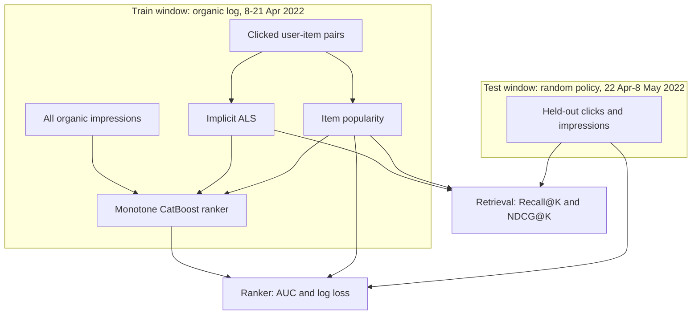

# KuaiRand two-stage recommender

Short-video recommender for the public [KuaiRand-Pure](https://zenodo.org/records/10439422) logs. Candidate generation (implicit ALS) and a pointwise CatBoost ranker are trained on the organic traffic from 8–21 April 2022 and scored on the later random-policy window, beside a popularity baseline fit on the same train rows.

Random exposure is the unbiased slice in KuaiRand: every impression in that window was shown under a random policy, so offline click metrics are not just a replay of the production ranker.

## Architecture



Serving still follows the same split: retrieve a candidate pool, then score it with the ranker. The offline numbers below are the catalog-level retrieval eval and the impression-level ranker eval, not a replay of the FastAPI path.

## Data and features

| Split | File | Rows | Role |
| --- | --- | --- | --- |
| Train | `log_standard_4_08_to_4_21_pure.csv` | 1,141,112 | Organic impressions, click rate 0.463447 |
| Test | `log_random_4_22_to_5_08_pure.csv` | 1,186,059 | Random-policy impressions, click rate 0.176158 |

The retrieval catalog has 7,583 videos. Retrieval metrics use the 21,381 warm users who clicked in train and still have a test click on a video they had not clicked before.

Label for both stages is `is_click`.

**Retrieval**

- ALS: 64 factors, 15 iterations, L2 0.05, confidence alpha 40, one positive per clicked user-item pair, seed 42.
- Popularity: distinct train users who clicked the video.

**Ranker** (CatBoost log loss, depth 4, 150 iterations, learning rate 0.08, `l2_leaf_reg` 5, seed 42)

- `als_score`: dot product of the train-only user and item factors. Missing factors score 0.
- `pop_score`: `log1p` of the popularity count.
- `user_ctr`: Laplace-smoothed train click rate `(clicks + 1) / (impressions + 2)`. Users absent from train get the global train click rate.
- Each feature is monotone non-decreasing in predicted click probability.
- The popularity baseline is the same CatBoost setup fit on `pop_score` only.

Platform-wide video statistic files from the release are not used. They pool behavior across the whole collection window, including the test dates.

## Results

Numbers are copied from [`results/kuairand_pure_metrics.json`](results/kuairand_pure_metrics.json), produced by `make eval` on KuaiRand-Pure.

### Retrieval

Full catalog, macro-average over 21,381 users. Already-clicked train videos are removed from the list. With 7,583 videos, most future clicks sit outside the top 10, so absolute Recall@K stays small and the baseline comparison is the result that matters.

| Model | Recall@10 | NDCG@10 | Recall@20 | NDCG@20 | Recall@50 | NDCG@50 |
| --- | ---: | ---: | ---: | ---: | ---: | ---: |
| Popularity | 0.003293 | 0.003351 | 0.006236 | 0.00432 | 0.012593 | 0.006181 |
| ALS | 0.002819 | 0.002776 | 0.005357 | 0.003639 | 0.014008 | 0.006347 |

Popularity leads at 10 and 20. ALS leads Recall@50 and NDCG@50.

### Ranker

Scored on all 1,186,059 random-policy impressions.

| Model | AUC | Log loss |
| --- | ---: | ---: |
| Popularity | 0.573373 | 0.522033 |
| CatBoost ranker | 0.65684 | 0.664248 |

The ranker ranks clicks better (AUC 0.65684 versus 0.573373). Popularity has the lower log loss (0.522033 versus 0.664248). Historical user CTR still orders who is more likely to click under a random policy, while the probability level was learned on organic traffic whose click rate is 0.463447. Random-policy impressions land on the long tail, where a popularity model emits lower probabilities and lands closer to the 0.176158 test rate.

## Reproduce

```bash
bash scripts/download_kuairand_pure.sh
make eval
```

`make eval` writes `results/kuairand_pure_metrics.json`. A laptop-scale check that does not download KuaiRand:

```bash
make smoke
```

Other local targets: `make lint`, `make type`, `make test`.

## Design decisions

- **KuaiRand-Pure** is the smallest public variant (about 46MB compressed). KuaiRand-1K and KuaiRand-27K are the scale-up, not the run behind the table above.
- **Train on the organic log, test on the random-policy log.** That is the split KuaiRand publishes so offline click metrics are not only a replay of the logging policy.
- **Full-catalog retrieval.** Metrics are not computed against a sample of 100 negatives, which would inflate Recall@K.
- **Warm users only, with train clicks masked.** A video the user already clicked is not counted as a future hit and is not recommended again.
- **Monotone ranker.** An unconstrained tree fit the organic logging policy and washed out the positive test-set signal in user CTR and popularity. Constraining ALS score, popularity, and user CTR to be non-decreasing keeps those scores pointing the same way at serve time.
- **Pointwise log loss.** AUC and log loss are the ranker metrics, so the model is a click classifier rather than a pairwise YetiRank model.
- **Same model class for the ranker baseline.** Popularity is a CatBoost classifier on `pop_score` with the same depth, iterations, learning rate, and seed, so the gap is the extra features.

## Serving skeleton

The API, worker, and Docker Compose stack are the online shell around this training path.

```bash
uv sync --extra dev
cp .env.example .env
docker compose up -d
make api
```

- `POST /v1/events`
- `POST /v1/recommend`
- `GET /v1/items/{item_id}/similar`
- `POST /v1/experiments`
- `GET /health`
- `GET /ready`
- `GET /metrics`
