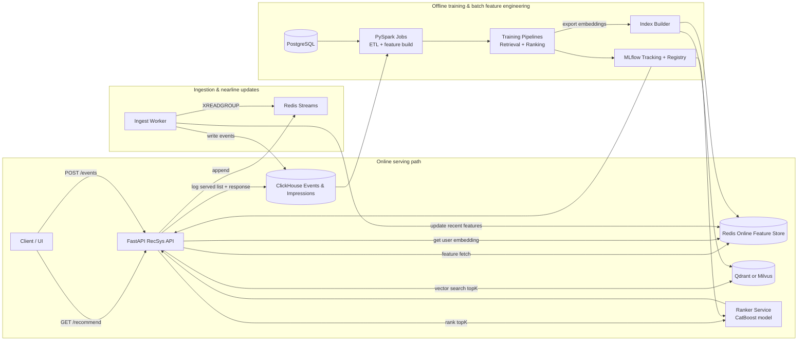
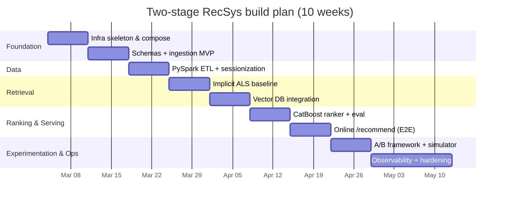

# Production-Grade Two-Stage Recommender System Blueprint for 2025–2026

## Executive summary

This report is a step-by-step, production-minded blueprint to build a **two-stage recommender system** (Retrieval + Ranking) that matches 2025–2026 industry expectations and your required stack: Python 3.11+, Asyncio, FastAPI, Pydantic, Redis, PySpark, ClickHouse/Postgres, Qdrant or Milvus, CatBoost, Implicit (ALS/BPR), TensorFlow Recommenders or PyTorch, MLflow, Docker (Docker Compose). The core idea is to implement the **classic two-stage IR dichotomy**: retrieve a few thousand candidates from a very large corpus, then rank a few hundred candidates with richer features under strict latency constraints. citeturn16view2turn9search11

This architecture isn’t stylistic—it’s the standard way large-scale recommenders meet latency and scale goals. The canonical industrial reference (YouTube) explicitly frames recommendations as two distinct problems: **candidate generation** then **ranking**, and describes approximate nearest-neighbor serving for candidate generation under “tens of milliseconds” latency budgets. citeturn20view2turn24view1 The TensorFlow Recommenders Retrieval task documentation (updated Jan 2026) also describes retrieval as O(thousands) from O(millions), with a separate ranker producing a short list. citeturn9search11

### Implementation status in this repository (March 4, 2026)

- Serving hardening is implemented: lifespan startup, dependency-aware `/ready`, per-stage recommend timeouts, deterministic fallback behavior.
- Logging path is implemented: `/v1/recommend` auto-logs impression events and slate logs into Redis Streams; worker writes to ClickHouse `events_raw` and `recommend_slates_raw` with DLQ handling.
- Experimentation APIs are implemented: `POST /v1/experiments`, `GET /v1/experiments/{experiment_key}`, and `POST /v1/experiments/assign` with sticky assignment (Redis + Postgres).
- Modeling stack now includes ALS + BPR + two-tower retrieval (`pipelines/training/retrieval_two_tower.py`) and extended blend features (`als_score`, `bpr_score`, `two_tower_score`).
- Extended local ops are wired via Docker Compose with API, worker, Prometheus, and Grafana provisioning.

Key “production-grade” decisions in this blueprint:

- **Domain**: short-form video / infinite feed optimized for watch time, because it is dominant in 2025–2026 user attention and because watch-time optimization has strong published industrial precedent. citeturn2search1turn2news44turn20view3  
- **Datasets**: use **KuaiRand** as the main behavioral log dataset (contains timestamps + click/play + multiple feedback signals + explicit random exposure indicator and a “random policy” slice for unbiased evaluation), and optionally **KuaiRec** for dense “fully observed” evaluation and additional features. citeturn18view1turn8view0turn23view0turn18view0  
- **Retrieval**: implement three tiers: (1) strong non-neural baseline (Implicit ALS), (2) Implicit BPR, (3) two-tower deep retrieval (TFRS or PyTorch), evaluated by Recall@K and top-K retrieval metrics. citeturn21search0turn21search1turn9search11turn9search2  
- **Vector search**: place item embeddings in Qdrant or Milvus using HNSW, with explicit indexing/search parameters (M, ef_construct/efConstruction, ef) and freshness policies. citeturn14view2turn14view1turn14view0  
- **Ranking**: CatBoost ranking (YetiRankPairwise / PairLogitPairwise) with query groups and NDCG/MRR/Hitrate metrics, plus an **expected watch-time calibration plan** inspired by YouTube’s watch-time-weighted training formulation. citeturn17view0turn20view1turn10search1turn22search0  
- **Experimentation**: implement A/B assignment, full logging for impressions and outcomes, and sample-size/power calculations using standard power-analysis tooling; optionally incorporate CUPED for variance reduction. citeturn16view0turn16view1turn11search1  
- **Ops & governance**: MLflow Tracking + Model Registry, Docker Compose, ClickHouse materialized views for aggregations, Redis ACL/TLS, OWASP API Security Top 10 alignment, and GDPR “data protection by design” principles. citeturn13search0turn1search2turn13search1turn15search13turn12search2turn12search10turn12search3turn12search0

## Product domain and dataset strategy

### Recommended domain for 2025–2026

**Pick: short-form video “For You” feed (infinite scroll / swipe feed), optimized for watch time and retention.**

Justification:

- Short-video platforms dominate user attention and time spent in mainstream social usage. For example, the DataReportal Digital 2025 report highlights extremely high monthly time spent on TikTok (Android) and compares it to other major video/social apps. citeturn2search1turn2search5  
- Large-scale video services’ engagement is heavily expressed in **watch time**, and industrial recommender literature explicitly argues ranking by watch-time-related objectives helps reduce clickbait and capture engagement better than CTR alone. citeturn20view3turn20view1  
- This domain is also the best fit for your job’s business metrics framing (Retention, Watch Time) and for demonstrating two-stage retrieval+ranking with vector search (instant “similar items”, session context, cold-start). citeturn20view3turn18view1

### Dataset selection: primary and optional

Your project needs **(a) sequential logs with timestamps and multiple feedback signals**, and ideally **(b) exposure/randomness hooks** to mitigate exposure bias and to support credible offline evaluation.

**Recommended dataset stack (exact):**

1) **Primary**: **KuaiRand** (choose KuaiRand-1K first; upgrade to KuaiRand-27K for scale).  
KuaiRand provides:
- sequential logs with timestamps (time_ms), scenario tab, click (is_click), and watch-time proxy (play_time_ms, duration_ms) plus additional feedback signals;  
- an explicit flag **is_rand** for interactions from random intervention;  
- separate log files for previous two weeks vs next two weeks, enabling clean time-based splitting. citeturn18view1turn18view0turn6view0turn7view0

2) **Optional but valuable**: **KuaiRec** (for dense evaluation, additional raw features, and content/category metadata).  
KuaiRec provides:
- play_duration, video_duration, timestamp, watch_ratio;  
- rich side information (user features, item daily features, categories, social network);  
- recent releases of additional raw features and text-format caption/category info (notably updated Jan 2026). citeturn23view0turn23view3turn3view1

### Dataset option comparison table

| Option | What it’s best for | Pros | Cons | Why you’d pick it |
|---|---|---|---|---|
| KuaiRand-1K / 27K | Production-like sequential feed RecSys + A/B-ish evaluation | Real logs, timestamps, multiple feedback signals, explicit random interventions, rich user/item features, clean before/after period files citeturn18view1turn6view0 | Large (27K split is big); schema is domain-specific to KuaiRand | Best fit for 2025–2026 “feed” portfolio demonstrating retrieval+ranking+experiments |
| KuaiRec | Dense “fully observed” eval + feature richness | Near fully observed matrix (small matrix), watch_ratio label, rich side info; updated raw features (2026) citeturn23view3turn3view1 | Not as production-like for exposures; partly designed as evaluation testbed | Great second dataset for robust offline evaluation, ablations, and cold-start studies |
| MovieLens (fallback) | Simple tutorials, quick prototyping | Easy, common baseline; directly supported in many tutorials citeturn0search0 | No real watch-time; limited realism for feed systems | Only if you need a light starting point before moving to KuaiRand |

### Exact download links and commands

Use these **exact, reproducible download commands**.

**KuaiRand (Zenodo record + direct files):** citeturn7view0turn8view0
```bash
# KuaiRand-1K (recommended start; ~1.1GB compressed)
wget https://zenodo.org/records/10439422/files/KuaiRand-1K.tar.gz
tar -xzvf KuaiRand-1K.tar.gz

# KuaiRand-27K (scale-up; ~9.9GB compressed)
wget https://zenodo.org/records/10439422/files/KuaiRand-27K.tar.gz
tar -xzvf KuaiRand-27K.tar.gz

# KuaiRand-Pure (small; ~47MB compressed)
wget https://zenodo.org/records/10439422/files/KuaiRand-Pure.tar.gz
tar -xzvf KuaiRand-Pure.tar.gz
```

**KuaiRec (Zenodo files):** citeturn23view0
```bash
wget https://zenodo.org/records/18164998/files/KuaiRec.zip
unzip KuaiRec.zip

# optional extra files (raw features / captions / categories)
wget https://zenodo.org/records/18164998/files/kuairec_caption_category.csv
wget https://zenodo.org/records/18164998/files/video_raw_categories_multi.csv
wget https://zenodo.org/records/18164998/files/user_features_raw.csv
```

### Schema mapping to production logs

You must log **impressions + outcomes** in a way that aligns with ranking training. The YouTube paper trains ranking on impression data, labeling positive/negative impressions and weighting positives by watch time to estimate expected watch time. citeturn20view1turn20view3

**KuaiRand raw → your production event schema mapping (recommended):** citeturn18view1

| Production field | Type | KuaiRand source | Meaning |
|---|---|---|---|
| user_id | int | user_id | user identifier |
| item_id | int | video_id | content identifier |
| ts_ms | int | time_ms | event timestamp in ms |
| event_date | YYYYMMDD int | date | partition-friendly date |
| context.tab | int | tab | scenario id [0..14] |
| impression_id | uuid/str | derived | unique row id you generate |
| is_click | int/bool | is_click | click/valid play depending on UI definition citeturn18view1 |
| watch_time_ms | int | play_time_ms | watch time proxy |
| item_duration_ms | int | duration_ms | duration |
| long_view | int/bool | long_view | thresholded “meaningful view” |
| is_like / is_follow / is_comment / is_forward / is_hate | int/bool | respective fields | engagement signals |
| is_random_exposure | int/bool | is_rand | interaction from random intervention |
| device_type | enum | derived from user_features | e.g., map phone_brand/model to “android-mid”, etc. |
| session_id | str | derived | sessionize by inactivity gap |

### Data augmentation plan to simulate production-grade logs

KuaiRand already provides many necessary signals, but you still must augment to emulate a serving system:

1) **Sessionization**: set `session_id` by user and time gaps. Use a 30-minute inactivity threshold (industry-standard in analytics tooling) as default; make it configurable. citeturn19search0turn19search8

2) **Impression-level logging**: treat each log row as an **impression opportunity** (an item shown in a feed context), and treat `is_click=1` as “clicked/valid play” and `watch_time_ms` as outcome. KuaiRand explicitly defines `is_click` semantics by UI. citeturn18view1

3) **Candidate-set logging (for learning-to-rank)**: every `GET /recommend` call should generate a `request_id` and log:
- retrieval model version + ranker model version  
- the full candidate set (IDs + retrieval scores)  
- the final top-N list served  
This is required to debug offline/online mismatch and to train rankers on realistic candidate distributions. (The YouTube paper emphasizes ranking’s role in calibrating/ensembling candidate sources whose scores are not directly comparable.) citeturn20view3

4) **Negative exposure simulation (if needed)**: if you need explicit “unclicked” impressions, you can synthesize additional exposure rows by sampling items shown in the same `tab` and time bucket but not interacted, then label as `is_click=0, watch_time_ms=0`. Use KuaiRand’s “random policy” slices to support more unbiased sampling. citeturn6view0turn18view1

## System architecture and repository design

### Architecture diagram and responsibilities

Below is the recommended **local-first production architecture** (Docker Compose friendly) with strict boundaries between ingestion, offline training, vector indexing, and online inference.



**Component responsibility table (practical “contract”):**

| Component | Primary responsibility | “Production-grade” acceptance criteria |
|---|---|---|
| FastAPI RecSys API | orchestrate retrieval→ranking, enforce timeouts, log impressions/events | async endpoints; p95 latency budget (target <150ms local); deterministic fallbacks; structured logging citeturn1search1turn20view1 |
| Redis Online Feature Store | fast feature/embedding lookup; caching; recent events | keys versioned; TTL strategy; batched reads via pipelining citeturn13search3 |
| Redis Streams + worker | decouple event ingestion from DB writes; update online features | consumer group semantics; trim & retention policy citeturn15search3turn15search10 |
| Qdrant or Milvus | ANN retrieval over item embeddings; optional filtered search | explicit HNSW params + monitoring recall/latency tradeoffs citeturn14view2turn14view0turn14view1 |
| ClickHouse | immutable event/impression store; analytics; offline datasets | MergeTree partitioning; MVs for aggregations; high ingest citeturn1search3turn15search13 |
| PostgreSQL | metadata/config store: experiments, feature definitions, model pointers | partition large tables when needed citeturn13search2 |
| MLflow | experiment tracking + model registry/versioning | DB-backed registry + reproducible runs citeturn13search0turn1search2turn1search5 |
| PySpark jobs | build training tables, features, evaluation datasets | reproducible jobs; idempotent writes; optional micro-batch flows citeturn15search8turn15search5 |

### Implementation milestones and weekly plan

Assume an experienced ML engineer working **12–18 hours/week**. Total: ~10 weeks. Adjust by scaling dataset (Pure → 1K → 27K). KuaiRand file structure naturally supports phased scaling. citeturn18view1

**Milestone plan (actionable):**

| Week | Priority | Goal | Tasks (concrete) | Est. time |
|---|---|---|---|---|
| 1 | P0 | Repo + infra skeleton | Docker Compose: ClickHouse/Postgres/Redis/Qdrant(or Milvus)/MLflow/API; health endpoints; Makefile; formatting + typing gates | 14–18h |
| 2 | P0 | Data ingestion & schemas | Define event schema; implement `/events`; Redis Streams worker; ClickHouse tables; unit tests on idempotent insert | 14–18h |
| 3 | P0 | Offline ETL MVP | PySpark batch job to parse KuaiRand logs into canonical events; sessionization; basic user/item aggregates; store in ClickHouse | 14–20h |
| 4 | P0 | Retrieval baseline | Train Implicit ALS + evaluate Recall@K; export embeddings; build “candidate retrieval” endpoint | 12–18h |
| 5 | P0 | Vector DB integration | Create collection/index; upsert item vectors; retrieval via ANN; latency + recall benchmarks; filtered search rules | 12–18h |
| 6 | P0 | Ranking v1 (CatBoost) | Build training data from retrieval candidates; define query groups; train CatBoostRanker; compute NDCG/MRR/HitRate; log to MLflow | 16–22h |
| 7 | P0 | Online inference end-to-end | Implement `/recommend` (retrieval→rank); caching; fallbacks; structured logs of served lists; backpressure/timeouts | 14–20h |
| 8 | P1 | Experimentation | A/B assignment; store experiment config; log metrics; implement offline replay simulator using random exposures | 12–18h |
| 9 | P1 | Observability & drift | latency dashboards (ClickHouse + Grafana optional); feature freshness checks; model registry promotion workflow | 12–18h |
| 10 | P1 | Hardening + portfolio polish | README + tech blog; reproducibility scripts; load testing; clean architecture diagrams; “risk register” | 12–18h |

A timeline view:



### Monorepo layout (Python-first, service boundaries)

Use a monorepo with clear service separation and shared libraries. This makes the portfolio read like a real production codebase.

```text
recsys-platform/
  README.md
  pyproject.toml
  Makefile
  docker-compose.yml
  .github/workflows/ci.yml

  libs/
    common/
      __init__.py
      config.py
      logging.py
      time.py
      typing.py
    schemas/
      __init__.py
      events.py
      recommend.py
      experiments.py
    storage/
      clickhouse.py
      postgres.py
      redis.py
      vector_db.py

  services/
    api/
      main.py
      routers/
        recommend.py
        events.py
        health.py
        experiments.py
      deps.py
      settings.py
    worker/
      main.py
      consumers/
        events_consumer.py
      settings.py
    ranker/
      service.py
      model_loader.py

  pipelines/
    spark/
      etl_events.py
      build_features.py
      build_training_sets.py
    training/
      retrieval_implicit.py
      retrieval_bpr.py
      retrieval_two_tower.py
      build_embeddings.py
      ranking_catboost.py
      eval_offline.py
    indexing/
      upsert_qdrant.py
      upsert_milvus.py

  mlflow/
    tracking_server/  # optional local config
      Dockerfile
      mlflow_server.sh

  infra/
    clickhouse/
      init.sql
    postgres/
      init.sql
    grafana/           # optional
    prometheus/        # optional

  notebooks/
    00_data_validation.ipynb
    01_retrieval_eval.ipynb
    02_ranking_eval.ipynb
```

### Key API contracts (endpoints + Pydantic schemas)

Keep API contracts stable and versioned. Recommended endpoints:

- `POST /v1/events` — ingest user events (impressions + outcomes)
- `POST /v1/recommend` — get feed recommendations (retrieval + ranking)
- `GET /v1/items/{item_id}/similar` — item-to-item similarity via vector DB
- `POST /v1/experiments/assign` — deterministic experiment assignment
- `GET /health`, `GET /ready` — probe endpoints

Example Pydantic models (schematic):

```python
from pydantic import BaseModel, Field
from typing import Literal, Optional, List, Dict

class DeviceContext(BaseModel):
    device_type: Optional[str] = None
    locale: Optional[str] = None
    tab: Optional[int] = None

class EventIn(BaseModel):
    user_id: int
    item_id: int
    ts_ms: int
    session_id: Optional[str] = None
    event_type: Literal["impression", "click", "watch", "like", "follow", "comment", "forward", "hate"]
    watch_time_ms: Optional[int] = None
    item_duration_ms: Optional[int] = None
    is_random_exposure: Optional[bool] = None
    context: Optional[DeviceContext] = None
    request_id: Optional[str] = None  # if event is tied to a served recommendation slate

class RecommendRequest(BaseModel):
    user_id: int
    session_id: Optional[str] = None
    k: int = Field(default=20, ge=1, le=200)
    tab: Optional[int] = None
    device: Optional[DeviceContext] = None
    forbid_seen_last_n: int = Field(default=200, ge=0, le=5000)

class RecommendedItem(BaseModel):
    item_id: int
    score: float
    rank: int
    retrieval_score: Optional[float] = None
    reason: Optional[Dict[str, str]] = None  # lightweight human-readable explanation

class RecommendResponse(BaseModel):
    request_id: str
    user_id: int
    items: List[RecommendedItem]
    model_versions: Dict[str, str]  # retrieval / ranker versions
    latency_ms: Dict[str, float]    # stage timings
    fallback_used: Optional[str] = None
```

## Data engineering and feature store design

### Canonical event schema for ClickHouse

The schema below matches what you need to train and debug a two-stage system, and is aligned with impression-based ranking formulations described in industrial literature. citeturn20view3turn18view1

**Table design principles:**
- store raw events as immutable append-only  
- partition by date for retention and query pruning  
- include request_id and model versions for reproducibility  
- keep “online” features in Redis, “offline” aggregates in ClickHouse MVs citeturn1search3turn15search13turn13search3

Example ClickHouse DDL (events/impressions):

```sql
CREATE TABLE IF NOT EXISTS events_raw
(
    event_date Date,
    ts_ms UInt64,
    user_id UInt32,
    session_id String,
    request_id String,
    item_id UInt32,
    tab UInt8,
    event_type LowCardinality(String),

    is_click UInt8,
    watch_time_ms UInt32,
    item_duration_ms UInt32,
    long_view UInt8,

    is_like UInt8,
    is_follow UInt8,
    is_comment UInt8,
    is_forward UInt8,
    is_hate UInt8,
    is_random_exposure UInt8,

    retrieval_model_version String,
    ranker_model_version String
)
ENGINE = MergeTree
PARTITION BY toYYYYMM(event_date)
ORDER BY (event_date, user_id, session_id, ts_ms)
SETTINGS index_granularity = 8192;
```

Why MergeTree: ClickHouse docs describe MergeTree-family engines as the most common/robust choice for high ingest and large volumes. citeturn1search3turn1search6

### Aggregations and offline features with ClickHouse materialized views

Use materialized views to maintain rollups and speed evaluation dashboards. ClickHouse MVs are designed to transform/aggregate inserted rows into target tables (incrementally). citeturn15search13turn15search16

Example: per-user daily aggregates (watch time, views, likes):

```sql
CREATE TABLE IF NOT EXISTS user_daily_agg
(
    day Date,
    user_id UInt32,
    tab UInt8,
    impressions UInt64,
    clicks UInt64,
    watch_time_ms UInt64,
    long_views UInt64,
    likes UInt64,
    follows UInt64
)
ENGINE = SummingMergeTree
PARTITION BY toYYYYMM(day)
ORDER BY (day, user_id, tab);

CREATE MATERIALIZED VIEW IF NOT EXISTS mv_user_daily_agg
TO user_daily_agg
AS
SELECT
    event_date AS day,
    user_id,
    tab,
    count() AS impressions,
    sum(is_click) AS clicks,
    sum(watch_time_ms) AS watch_time_ms,
    sum(long_view) AS long_views,
    sum(is_like) AS likes,
    sum(is_follow) AS follows
FROM events_raw
WHERE event_type = 'impression'
GROUP BY day, user_id, tab;
```

### PostgreSQL schemas for metadata and experimentation

Use Postgres for:
- experiment definitions (variant weights, start/end)  
- model registry pointers (if you want app-level control beyond MLflow)  
- feature definitions/versioning (optional)  

Postgres supports declarative partitioning for large time-series tables if needed. citeturn13search2

### Online feature store in Redis: key design

Use Redis for:
- user embedding (current)  
- user recent events window  
- experiment assignment  
- frequently accessed item metadata cache (optional)

Batch reads are essential; Redis pipelining is explicitly designed to reduce round trips by issuing multiple commands at once. citeturn13search3

Recommended key patterns:

| Key | Type | Value | TTL |
|---|---|---|---|
| `u:{user_id}:emb:v{ver}` | string | float32 bytes (embedding) | 1–7 days |
| `u:{user_id}:recent` | list | latest item_ids | 1–3 days |
| `u:{user_id}:exp:{exp_id}` | string | variant id | experiment duration |
| `req:{request_id}:slate` | string/json | served list + model versions | 7–30 days |

### PySpark jobs: ETL + sessionization + training tables

PySpark Structured Streaming supports `foreachBatch` for micro-batch writes and emphasizes batchId for deduplication and transactional writes. citeturn15search8turn15search5

A pragmatic approach for a portfolio:
- implement **batch ETL** first (KuaiRand CSV → ClickHouse)  
- optionally add micro-batch streaming to demonstrate production realism

Sessionization guideline:
- create new session if inactivity > 30 minutes (Google Analytics default). citeturn19search0turn19search8

Pseudo-ETL outline (Spark):

```python
# pipelines/spark/etl_events.py (conceptual)
from pyspark.sql import functions as F, Window as W

# read KuaiRand log CSVs (standard + random)
df = spark.read.csv(path, header=True, inferSchema=True)

df = df.withColumn("event_date", F.to_date(F.from_unixtime(F.col("time_ms")/1000))) \
       .withColumnRenamed("video_id", "item_id") \
       .withColumn("is_click", F.col("is_click").cast("int")) \
       .withColumn("watch_time_ms", F.col("play_time_ms").cast("int")) \
       .withColumn("item_duration_ms", F.col("duration_ms").cast("int")) \
       .withColumn("long_view", F.col("long_view").cast("int"))

w = W.partitionBy("user_id").orderBy("time_ms")
df = df.withColumn("prev_ts", F.lag("time_ms").over(w)) \
       .withColumn("new_sess", (F.col("prev_ts").isNull() | (F.col("time_ms") - F.col("prev_ts") > 30*60*1000)).cast("int")) \
       .withColumn("session_num", F.sum("new_sess").over(w)) \
       .withColumn("session_id", F.concat_ws("-", F.col("user_id").cast("string"), F.col("session_num").cast("string")))

# write to ClickHouse (via JDBC or clickhouse-spark connector)
```

## Modeling: retrieval, vector search, and ranking

### Retrieval methods to implement and when to use them

Retrieval retrieves a **manageable candidate set** from a huge corpus. Industrial references describe candidate generation as the first stage and use approximate nearest neighbor serving for speed. citeturn16view2turn24view1

Implement these retrieval approaches (in this order):

| Method | Why it matters | Strengths | Tradeoffs | Primary sources |
|---|---|---|---|---|
| Popularity + trends baseline | sanity + fallback | stable, fast | not personalized | (baseline engineering practice) |
| Implicit ALS | strong implicit-feedback CF baseline | scalable; well-studied for implicit data | limited content/context | Hu/Koren/Volinsky implicit CF; implicit library docs citeturn21search0turn9search21 |
| Implicit BPR | pairwise ranking in CF setting | directly optimizes pairwise preferences; integrates cleanly with implicit-matrix pipelines | sensitive to sampling/hyperparameters | BPR paper; implicit library docs citeturn21search1turn9search21 |
| Two-tower deep retrieval (TFRS or PyTorch) | modern “FAANG-grade” retrieval | embeddings + context; scalable serving via ANN | needs harder training/eval discipline | TFRS Retrieval task & FactorizedTopK docs (Jan 2026); YouTube candidate sampling description citeturn9search11turn9search2turn24view1 |

### Retrieval training pipelines (actionable recipes)

#### Implicit ALS (baseline)

- Build a user-item interaction matrix from KuaiRand “standard” logs (use is_click or long_view as interaction strength). KuaiRand provides these signals explicitly. citeturn18view1  
- Use implicit-feedback weighting ideas from the classic implicit CF formulation (confidence-weighted preference) and ALS optimization. citeturn21search0  
- Train ALS with moderate factor dimension to start (64–128), then scale.

#### Implicit BPR

- Train `implicit.bpr.BayesianPersonalizedRanking` as the second retrieval model and compare against ALS on Recall@K / HitRate@K. Use the same implicit interaction matrix to keep pipelines consistent and simplify artifact handling. citeturn21search1turn9search21  
- Report Recall@K and HitRate@K for retrieval. (HitRate definition and interpretation are standard in recommender evaluation references.) citeturn22search0turn22search1

#### Two-tower deep retrieval (TFRS or PyTorch)

Two-tower retrieval is a factorized model with separate query (user) and candidate (item) towers. The TFRS Retrieval task explicitly describes this and frames retrieval vs ranking behavior. citeturn9search11

**Negative sampling**:
- Use in-batch negatives or sampled softmax/candidate sampling. The YouTube paper describes sampling negatives (“candidate sampling”) and sampled softmax for extreme multiclass training. citeturn24view1

**Evaluation**:
- Use top-K retrieval metrics; TFRS provides `tfrs.metrics.FactorizedTopK` (updated Jan 2026) for top-K categorical accuracy / hit-in-topK style measures. citeturn9search2

**Embedding dimension guidance**:
- Start with 64–128 dimensions for local reproducibility; choose 256 only if you have compute headroom. (YouTube publicly reports using 256-d embeddings for large vocabularies; treat this as an upper reference rather than a requirement.) citeturn24view1

### Retrieval evaluation standard

Report retrieval metrics distinctly from ranking metrics:

- **Recall@K** and/or **HitRate@K** on held-out interactions for retrieval output quality. citeturn22search0turn22search1  
- Use **time-based splits** to avoid leakage. (YouTube highlights that predicting future watch rather than randomly held-out watch avoids leakage and better aligns with live metrics.) citeturn20view0turn16view2

### Vector DB design: indexing strategy, freshness, and latency targets

#### Qdrant configuration (HNSW + on-disk options)

Qdrant documentation specifies HNSW parameters (`m`, `ef_construct` and search-time `ef`) and discusses their tradeoffs. citeturn14view2turn14view1

Recommended starter config (collection create):

```json
{
  "vectors": { "size": 128, "distance": "Cosine", "on_disk": false },
  "hnsw_config": { "m": 16, "ef_construct": 128 }
}
```

If memory is limited, Qdrant documents using `on_disk` for vectors/HNSW and increasing `m`/`ef_construct` for precision, with performance depending on disk IOPS. citeturn14view1

Qdrant also documents default storage-level HNSW settings and notes that search-time `ef` defaults to `ef_construct`. citeturn14view2

#### Milvus configuration (HNSW)

Milvus documentation explicitly defines `M`, `efConstruction`, and search-time `ef`, provides value ranges and tuning suggestions (including “ef recommended [K, 10K]”), and includes code examples for index build and search. citeturn14view0

Recommended starter index params:

- `M`: 16–64 (higher improves recall but costs memory and insertion time) citeturn14view0  
- `efConstruction`: 100–360 (higher improves graph quality but slows build) citeturn14view0  
- search `ef`: start at `max(50, 2*K)` and tune for recall/latency tradeoff (Milvus notes ef controls breadth and affects search time). citeturn14view0

#### Freshness policy (practical and “portfolio-real”)

Short-form feed recommenders have fast item churn; freshness is part of “production-grade” credibility. citeturn6view0turn24view1

Implement a 3-layer freshness policy:

1) **Item embeddings**: rebuild daily (batch job), with incremental upserts for new items hourly (optional).  
2) **User embeddings**: update daily and after “significant” session activity (nearline) by writing to Redis.  
3) **Index lifecycle**:
- create a new collection/version (blue/green)  
- bulk upsert  
- switch alias in serving config  
This supports rollback and reproducibility (key for portfolio credibility).

### Ranking: feature set, CatBoostRanker recipe, and watch-time calibration

#### Ranking problem framing

Ranking runs only on a small candidate set, so you can incorporate rich features. The YouTube paper emphasizes ranking calibrates candidate predictions for UI context, uses richer features because only hundreds of items are scored, and generally tunes a watch-time-related objective to avoid clickbait. citeturn20view3turn20view1

#### Feature list (minimal viable + strong)

Group features into four buckets:

**User features**
- user activity bucket, follower counts, device info (from KuaiRand user_features) citeturn18view0  
- recent watch_time stats, average completion ratio (from ClickHouse aggregates)

**Item features**
- video duration, upload recency, category tags (KuaiRand video_features_basic/statistic) citeturn18view0turn18view1  
- normalized popularity features (show_cnt, play_cnt, etc.) citeturn18view0

**Context features**
- tab/scenario, time-of-day, session position, device_type

**Cross / interaction features**
- dot(user_emb, item_emb)  
- retrieval score (ANN similarity or MF score)  
- recency of last interaction with the author/category  
- “seen recently” flag from Redis recent history

#### Training data construction (critical to avoid offline/online skew)

Train the ranker on **retrieval candidates**, not on the full item universe. The YouTube paper explicitly states ranking ensembles candidate sources whose scores may not be comparable; training should reflect the candidate set distribution. citeturn20view3

Recipe:
1) Choose a decision point: each feed request or each “next item” event in sequence.  
2) Use retrieval model to get top 500–2000 candidates (exclude previously seen N).  
3) Label candidates:
- positive: the actually interacted next items (or items with long_view=1)  
- negatives: other candidates not interacted  
4) Form `query_id = request_id` groups for CatBoost ranking.

#### CatBoostRanker: loss functions, grouping, parameters

CatBoost provides multiple ranking objectives and describes YetiRank/YetiRankPairwise as ranking methods that can optimize ranking-metric-like surrogates; since CatBoost 1.2.1, the `mode` parameter enables optimizing specific ranking metrics such as NDCG/MRR. citeturn17view0

Recommended loss choice (fast + strong baseline):
- `loss_function="YetiRankPairwise"` (pairwise ranking)
- optionally try `loss_function="PairLogitPairwise"` for pairwise logistic formulation (CatBoost documents PairLogit usage and group-level pair generation behavior). citeturn17view0

Example CatBoost params (starter):

```python
params = {
    "loss_function": "YetiRankPairwise",
    "iterations": 3000,
    "learning_rate": 0.05,
    "depth": 8,
    "l2_leaf_reg": 10.0,
    "random_seed": 42,
    "eval_metric": "NDCG:top=10",
    "task_type": "CPU",
    "od_type": "Iter",
    "od_wait": 100,
}
```

Depth constraints differ by CPU/GPU and objective types; CatBoost documents depth limits for pairwise modes (notably GPU depth limits). citeturn17view2

#### Offline ranking metrics to report

- **NDCG@10**: the standard position-sensitive ranking metric introduced in IR literature. citeturn10search1turn10search5  
- **MRR@10**: focuses on the rank of the first relevant item; defined in standard IR references. citeturn10search14turn10search10  
- **HitRate@10**: share of users for whom at least one relevant item appears in top-K; commonly used in RecSys evaluation. citeturn22search0turn22search1

#### Watch-time optimization and calibration plan

A robust and credible approach is to explicitly model **expected watch time per impression**, following the published YouTube approach: positives weighted by observed watch time and negatives weighted by 1, producing odds that approximate expected watch time under small click probability assumptions. citeturn20view1turn20view3

For your portfolio, implement **two ranking heads** and combine:

1) **p(valid_play)** model (classification): predicts probability of meaningful engagement (`is_click` / `long_view`)  
2) **E(watch_time | valid_play)** model (regression): predicts watch time conditional on engagement (target `log1p(watch_time_ms)`)

Then compute:

`expected_watch_time = p_valid_play * exp(pred_log_watch_time)`

This is aligned with the “expected watch time per impression” framing in the YouTube ranking section. citeturn20view1turn20view3

Calibration step:
- bucket predictions into deciles
- compute observed mean watch_time per bucket
- fit a monotonic mapping (isotonic) to convert model score → expected watch time (for interpretability and stable business dashboards)

## Serving, experimentation, observability, and governance

### FastAPI async inference flow, caching, and latency budgets

FastAPI documents `async def` path operations and concurrency semantics; use async for I/O (Redis, vector DB, ClickHouse logging). citeturn1search1

**Inference pipeline budget (portfolio target):**
- feature fetch from Redis: 5–15ms  
- vector search topK=1000: 10–40ms (depends on ef and index) citeturn14view0turn14view2  
- ranker scoring 1000 items: 10–30ms (CatBoost CPU)  
- total p95: <150ms local (with warm caches)

Industrial reference: YouTube notes candidate generation under “tens of milliseconds” requires sublinear approximate scoring and uses nearest-neighbor serving. Use this as your “design justification” even if local latency differs. citeturn24view1turn24view0

**Caching strategy:**
- cache per-user embedding in Redis (most impactful)  
- cache recent seen items list  
- cache “top global/trending” per tab/time bucket for cold-start

**Batching strategy:**
- batch Redis calls via pipelining when fetching multiple feature keys. citeturn13search3

**Timeouts:**
- enforce per-stage timeouts; if vector search exceeds budget, fall back to cached popular list or smaller ef.

**Cold-start / empty-feed fallbacks:**
- New user: trending-by-tab + lightweight exploration  
- New item: content/category-based similarity (if you use categories/captions), plus global exploration  
- Empty candidate set: drop filters (“seen last N”) gradually

### Experimentation: A/B testing design and online simulation

#### A/B design

Use user-level randomization (unit = user_id) and persist assignment to avoid cross-contamination. The online experimentation literature emphasizes trustworthiness and formalized evaluation criteria (OEC), and warns against drawing causal conclusions from observational correlations. citeturn16view0

**Metrics to track (must):**
- Watch Time per user / per session (primary)  
- Retention proxy: returning sessions within N days (or next-day return)  
- CTR / valid_play rate for feed impressions  
- Guardrails: latency, errors, duplicates, diversity

#### Sample size and power calculations

Use power analysis to ensure your experiments can detect intended effect sizes. The Statsmodels power API provides `solve_power` for independent-sample t-test calculations (updated Jan 2026), and you can similarly use proportion power for CTR. citeturn11search1turn11search5

Example (watch time as continuous metric; t-test approximation):

```python
from statsmodels.stats.power import TTestIndPower

analysis = TTestIndPower()
# effect_size = (mu_treat - mu_control)/sigma
n_per_group = analysis.solve_power(effect_size=0.02, alpha=0.05, power=0.8, ratio=1.0)
print(n_per_group)
```

Variance reduction option:
- CUPED is a well-known technique to reduce variance using pre-experiment covariates, improving sensitivity (Deng et al. 2013). citeturn16view1

#### Online simulation approach using KuaiRand

KuaiRand is uniquely useful because it includes **random interventions** (`is_rand`) and explicit “random policy” interaction logs, enabling more credible offline evaluation under exposure bias than purely logged data. citeturn6view0turn18view1

Simulation plan:
1) Use earlier period logs for training (e.g., 4/08–4/21 standard logs), later period for evaluation (4/22–5/08). citeturn18view1  
2) Replay sessions: at each step, generate candidates with your retrieval + ranker; record what you would have served.  
3) Compare against observed outcomes where possible; and treat random exposures as a less-biased slice for estimating counterfactual performance.

### Observability & ops

#### What to monitor

Minimum dashboard set:

- **API latency**: p50/p95 end-to-end + per-stage breakdown  
- **Vector search recall proxy**: offline Recall@K trend vs latency as ef changes (Qdrant and Milvus both describe ef tradeoffs) citeturn14view2turn14view0  
- **Feature freshness**: lag between last event and last embedding update  
- **Model version distribution**: which model versions served which traffic  
- **Fallback rate**: percent of requests using fallback (should be small, stable)

#### Model lifecycle via MLflow

- Use MLflow Tracking for parameters/metrics/artifacts and for searching runs; MLflow Tracking docs describe searching logged models and managing experiments. citeturn13search0turn13search4  
- Use MLflow Model Registry as the centralized model store with versioning/aliases/metadata. citeturn1search2turn1search5

#### Docker Compose deployment

Docker Compose docs define service configuration, startup order controls, and overall Compose spec usage. citeturn13search1turn13search5turn13search8

Your `docker-compose.yml` should include:
- clickhouse
- postgres
- redis
- vector DB (qdrant or milvus)
- mlflow
- api
- worker
- ranker (optional separate service)

Optional Kubernetes notes (portfolio “plus”):
- show how you would convert API/worker to deployments with HPA  
- move secrets to K8s secrets  
- add liveness/readiness probes

### Security, privacy, and compliance

Even in a portfolio, you should demonstrate “production-like” privacy posture:

- **Minimize PII**: use pseudonymous user_id; avoid storing raw device identifiers; store only coarse device_type. GDPR explicitly frames protection of personal data and includes concepts like “data protection by design and by default.” citeturn12search0  
- **Retention policies**: partitioned storage + scheduled deletion/TTL, especially for event logs.  
- **Access controls**:
  - Redis: use ACL-based authentication (recommended since Redis 6) and enforce least privilege. citeturn12search6turn12search2  
  - Redis encryption: use TLS/mTLS where applicable. citeturn12search10  
- **API security**: align endpoint authorization and resource access patterns with OWASP API Security Top 10 (e.g., guard against broken object level authorization). citeturn12search3  
- **Sensitive data in logs**: avoid logging request bodies with user identifiers; log request_id and hashed identifiers if needed.

## Example README, technical blog outline, and risk register

### Example README structure (copy-ready outline)

What reviewers want is reproducibility, clear architecture, and measurable results—especially around retrieval recall vs ranking NDCG and watch-time objectives.

**README sections:**
- What this system does (two-stage feed recommender)
- Architecture diagram (Mermaid)
- Quickstart (Docker Compose up; seed data; train; index; serve)
- Data:
  - KuaiRand download and preprocessing steps
  - schema definitions
- Models:
  - retrieval baselines + deep retrieval
  - ranking models + calibration
  - offline metrics tables
- Serving:
  - endpoints documentation
  - latency targets and measured results
- Experimentation:
  - A/B assignment strategy
  - metrics tracked
  - power-analysis method
- Ops:
  - MLflow UI usage
  - model registry promotion policy
  - monitoring dashboards
- Security:
  - data minimization + retention
  - Redis ACL/TLS + OWASP notes

### Technical blog outline (portfolio-grade)

Title suggestion: **“Building a Production-Grade Two-Stage Recommender (Retrieval + Ranking) with FastAPI, Vector Search, and Watch-Time Optimization”**

Outline:
- Why two-stage systems are standard (candidate generation vs ranking) citeturn16view2turn9search11  
- Data: from logged events to training sets (sessionization, impressions, outcomes) citeturn18view1turn19search8  
- Retrieval:
  - Implicit ALS baseline citeturn21search0turn9search21  
  - Two-tower training with candidate sampling citeturn24view1turn9search11  
- Vector search tuning (HNSW parameters and recall/latency tradeoff) citeturn14view2turn14view0  
- Ranking with CatBoost:
  - query grouping
  - NDCG/MRR/HitRate metrics citeturn10search1turn10search14turn22search0  
  - expected watch-time calibration inspired by YouTube citeturn20view1turn20view3  
- Serving and caching (async API, Redis pipelining) citeturn1search1turn13search3  
- Experiments and trustworthiness (power, CUPED) citeturn16view0turn16view1turn11search1  
- Lessons learned: offline/online skew, bias, drift, fallbacks

### Risk list and mitigation table

| Risk | Why it happens | Symptom | Mitigation |
|---|---|---|---|
| Offline/online skew | ranker trained on unrealistic negatives or full corpus | online metrics regress despite higher offline NDCG | train ranker on retrieval candidate sets; log candidate distributions citeturn20view3 |
| Leakage in evaluation | random split leaks future behavior | inflated offline metrics | time-based split; “rollback” style context selection citeturn20view0turn18view1 |
| Exposure bias | logged data reflects prior policy | brittle model; inconsistent offline vs online | use KuaiRand random exposures; evaluate on random-policy subset citeturn6view0turn18view1 |
| Vector DB recall drops | HNSW params too small or filters fragment graph | retrieval recall@K decreases | tune M/ef/ef_construct; monitor recall/latency curves citeturn14view2turn14view0turn14view1 |
| Latency spikes | blocking I/O, too-large ef, no caching | p95 latency increases; timeouts | Redis caching + pipelining; cap ef; enforce stage timeouts citeturn13search3turn14view0 |
| “Clickbait” optimization | optimizing CTR alone | higher CTR but lower watch time | optimize expected watch time; calibrate scores accordingly citeturn20view3turn20view1 |
| Experiment underpowered | insufficient sample size | unstable results; false extremes | power analysis with statsmodels; CUPED for variance reduction citeturn11search1turn16view1 |
| Secret/PII leakage | logs contain identifiers; no access controls | sensitive data in traces | data minimization; Redis ACL/TLS; OWASP API controls citeturn12search0turn12search2turn12search10turn12search3 |
